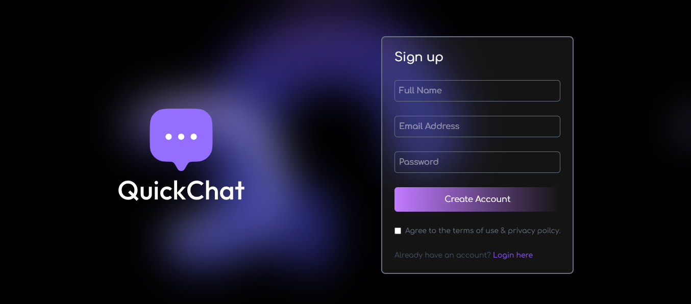

# Chat App (Fullstack MERN + React + Vite)

This is a real-time chat application built using the **MERN stack** (MongoDB, Express.js, React, Node.js) with **Vite** for frontend bundling.  
The project demonstrates authentication, WebSocket-based real-time messaging, and a clean modern UI.

# React + Vite

This template provides a minimal setup to get React working in Vite with HMR and some ESLint rules.

Currently, two official plugins are available:

- [@vitejs/plugin-react](https://github.com/vitejs/vite-plugin-react/blob/main/packages/plugin-react) uses [Babel](https://babeljs.io/) for Fast Refresh
- [@vitejs/plugin-react-swc](https://github.com/vitejs/vite-plugin-react/blob/main/packages/plugin-react-swc) uses [SWC](https://swc.rs/) for Fast Refresh

## Expanding the ESLint configuration

If you are developing a production application, we recommend using TypeScript with type-aware lint rules enabled. Check out the [TS template](https://github.com/vitejs/vite/tree/main/packages/create-vite/template-react-ts) for information on how to integrate TypeScript and [`typescript-eslint`](https://typescript-eslint.io) in your project.

---

## 🚀 Features
- 🔑 User Authentication (Login & Signup)
- 💬 Real-time Messaging (via WebSocket/Socket.io)
- 📱 Responsive UI (works on desktop & mobile)
- 🌐 REST API for chat and user management
- ⚡ Fast Refresh with Vite + React
- 🛡️ Secure password handling with bcrypt
- 📦 MongoDB database integration

---

## 🛠️ Tech Stack
**Frontend**
- React + Vite
- TailwindCSS (if included)
- Axios (for API calls)

**Backend**
- Node.js + Express.js
- MongoDB + Mongoose
- Socket.io (for real-time communication)

**Others**
- ESLint + Prettier for linting
- dotenv for environment configs

---

## 📂 Project Structure
```bash
Chat Application/
├── server/ # Express + MongoDB API
│ ├── models/ # Mongoose models
│ ├── routes/ # API routes
│ ├── controllers/ # Business logic
│ └── server.js # Entry point
│
├── frontend/ # React + Vite frontend
│ ├── src/
│ │ ├── components/
│ │ ├── pages/
│ │ ├── context/
│ │ └── App.jsx
│ └── vite.config.js
│
└── README.md
```

## ⚙️ Installation & Setup

### 1. Clone the repository

git clone https://github.com/mahamadayazmomin/Chat-Application.git \
cd Chat-Application

---

### 2. Setup Backend
```bash
cd backend
npm install
npm start   # starts backend server (default: http://localhost:5000)
```
---

## 🧪 Linting & Formatting

To check linting errors:\
npm run lint

---

## 📸 Screenshot



---

## Demo

You can check out a live demo of this Chat App [here](https://mahamadayazmomin.github.io/Chat-Application).

---

## 🤝 Contributing

Pull requests are welcome. For major changes, please open an issue first to discuss your idea.

---

## 📜 License

This project is licensed under the [MIT License](LICENSE).